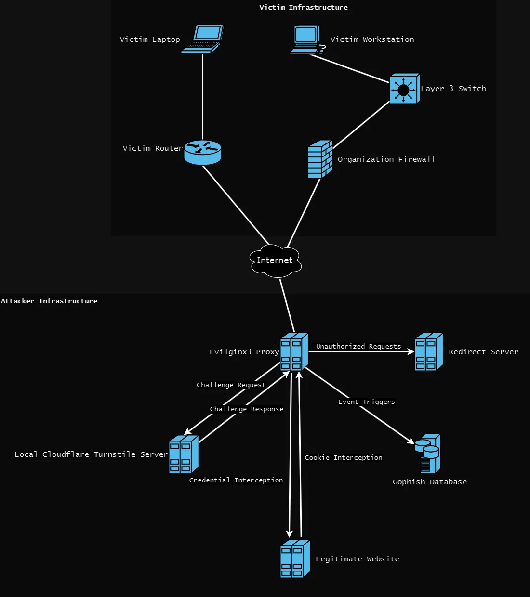
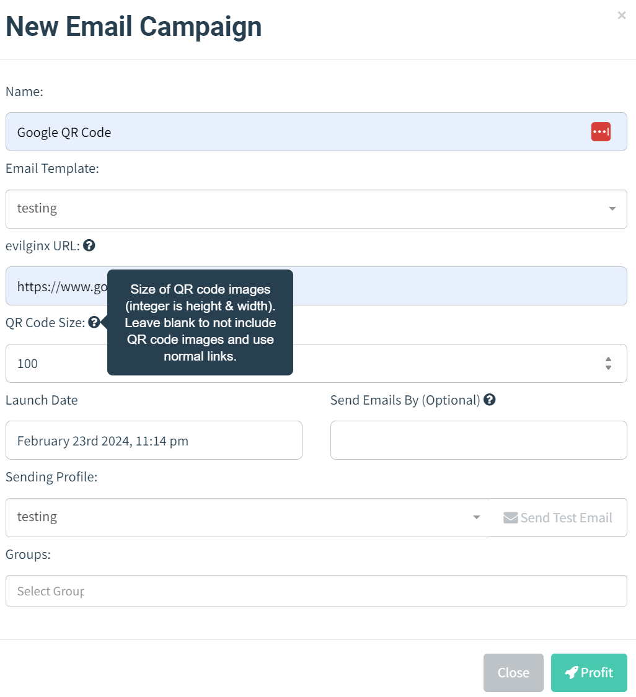
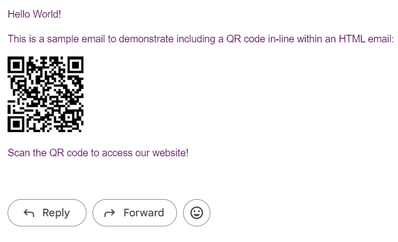
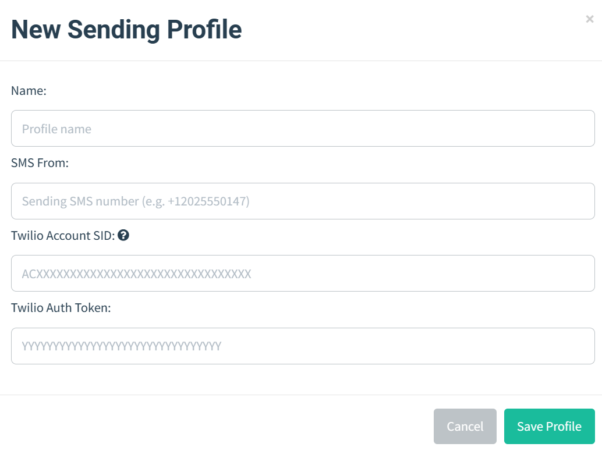

# Table of Contents

- [evilgophish](#evilgophish)
  * [A Word About Sponsorship](#a-word-about-sponsorship)
  * [Credits](#credits)
  * [Prerequisites](#prerequisites)
  * [Disclaimer](#disclaimer)
  * [Why?](#why)
  * [Background](#background)
  * [Infrastructure Layout](#infrastructure-layout)
  * [setup.sh](#setupsh)
  * [replace_rid.sh](#replace_ridsh)
  * [Email Campaign Setup](#email-campaign-setup)
  * [QR Code Generator](#qr-code-generator)
  * [SMS Campaign Setup](#sms-campaign-setup)
  * [Live Feed Setup](#live-feed-setup)
  * [A Word About Phishlets](#a-word-about-phishlets)  
  * [A Word About The Evilginx3 Update](#a-word-about-the-evilginx3-update)
  * [Debugging](#debugging)
  * [Apache2 Customiization](#apache2-customization)
  * [Installation Notes](#installation-notes)
  * [A Note About Campaign Testing And Tracking](#a-note-about-campaign-testing-and-tracking)
  * [A Note About The Blacklist and Tracking](#a-note-about-the-blacklist-and-tracking)  
  * [Changes to GoPhish](#changes-to-gophish)
  * [Changelog](#changelog)
  * [Issues and Support](#issues-and-support)
  * [Future Goals](#future-goals)
  * [Contributing](#contributing)

# evilgophish

Combination of [evilginx3](https://github.com/kgretzky/evilginx2) and [GoPhish](https://github.com/gophish/gophish).

# A Word About Sponsorship

This is the public, free version of the repository, **IT IS NOT THE LATEST VERSION**. I am purposefully keeping this public version of the repository behind my version for people that sponsor me via `GitHub Sponsors`. This means this version may be lacking bug fixes or features and there should be no expectations for bug fixes, adding features, or support here. Become a sponsor [here](https://github.com/sponsors/fin3ss3g0d) to gain access to the latest version.

## Credits

Before I begin, I would like to say that I am in no way bashing [Kuba Gretzky](https://github.com/kgretzky) and his work. I thank him personally for releasing [evilginx3](https://github.com/kgretzky/evilginx2) to the public. In fact, without his work this work would not exist. I must also thank [Jordan Wright](https://github.com/jordan-wright) for developing/maintaining the incredible [GoPhish](https://github.com/gophish/gophish) toolkit.

## Prerequisites

You should have a fundamental understanding of how to use `GoPhish`, `evilginx3`, and `Apache2`.

## Disclaimer

I shall not be responsible or liable for any misuse or illegitimate use of this software. This software is only to be used in authorized penetration testing or red team engagements where the operator(s) has(ve) been given explicit written permission to carry out social engineering. 

## Why?

As a penetration tester or red teamer, you may have heard of `evilginx3` as a proxy man-in-the-middle framework capable of bypassing `two-factor/multi-factor authentication`. This is enticing to us to say the least, but when trying to use it for social engineering engagements, there are some pain points. 

1. Lack of tracking - `evilginx3` does not provide unique tracking statistics per victim (e.g. opened email, clicked link, etc.), this is problematic for clients who want/need/pay for these statistics when signing up for a social engineering engagement.

2. Not a full social engineering toolkit - `evilginx3` only provides proxy man-in-the-middle capabilities, it does not provide all of the functionality required for a social engineering campaign via email/SMS. For example, it does not send emails to targets or provide this functionality.

3. No GUI - do we really need to explain this one further? We all love our GUIs and the visual representation of data for a social engineering campaign is invaluable. Operators can really get a thorough understanding as to the success of their social engineering campaigns by being able to view a visual representation of the data.

## Background

In this setup, `GoPhish` is used to send emails and provide a dashboard for `evilginx3` campaign statistics, but it is not used for any landing pages. Your phishing links sent from `GoPhish` will point to an `evilginx3` lure path and `evilginx3` will be used for landing pages. This provides the ability to still bypass `2FA/MFA` with `evilginx3`, without losing those precious stats. `Apache2` is simply used as a proxy to the local `evilginx3` server and an additional hardening layer for your phishing infrastructure. Realtime campaign event notifications have been provided with a local websocket/http server I have developed and full usable `JSON` strings containing tokens/cookies from `evilginx3` are displayed directly in the `GoPhish` GUI (and feed):


## Infrastructure Layout



- `evilginx3` will listen locally on port `8443`
- `GoPhish` will listen locally on port `8080` and `3333`
- `Apache2` will listen on port `443` externally and proxy to local `evilginx3` server
  - Requests will be filtered at `Apache2` layer based on redirect rules and IP blacklist configuration
    - Redirect functionality for unauthorized requests is still baked into `evilginx3` if a request hits the `evilginx3` server

## setup.sh

`setup.sh` has been provided to automate the needed configurations for you. Once this script is run and you've fed it the right values, you should be ready to get started. Below is the setup help (note that certificate setup is based on `letsencrypt` filenames):

```
Usage:
./setup <root domain> <subdomain(s)> <root domain bool> <redirect url> <feed bool> <rid replacement> <blacklist bool>
 - root domain                     - the root domain to be used for the campaign
 - subdomains                      - a space separated list of evilginx3 subdomains, can be one if only one
 - root domain bool                - true or false to proxy root domain to evilginx3
 - redirect url                    - URL to redirect unauthorized Apache requests
 - feed bool                       - true or false if you plan to use the live feed
 - rid replacement                 - replace the gophish default "rid" in phishing URLs with this value
 - blacklist bool                  - true or false to use Apache blacklist
Example:
  ./setup.sh example.com "accounts myaccount" false https://redirect.com/ true user_id false
```

Redirect rules have been included to keep unwanted visitors from visiting the phishing server as well as an IP blacklist. The blacklist contains IP addresses/blocks owned by ProofPoint, Microsoft, TrendMicro, etc. Redirect rules will redirect known *"bad"* remote hostnames as well as User-Agent strings. 

## replace_rid.sh

In case you ran `setup.sh` once and already replaced the default `RId` value throughout the project, `replace_rid.sh` was created to replace the `RId` value again.

```
Usage:
./replace_rid <previous rid> <new rid>
 - previous rid      - the previous rid value that was replaced
 - new rid           - the new rid value to replace the previous
Example:
  ./replace_rid.sh user_id client_id
```

## Email Campaign Setup

Once `setup.sh` is run, the next steps are: 

1. Start `GoPhish` and configure email template, email sending profile, and groups
2. Start `evilginx3` and configure phishlet and lure (must specify full path to `GoPhish` `sqlite3` database with `-g` flag)
3. Ensure `Apache2` server is started
4. Launch campaign from `GoPhish` and make the landing URL your lure path for `evilginx3` phishlet
5. **PROFIT**

## QR Code Generator

The `QR Code Generator` feature allows you to generate QR codes to deploy QR code social engineering campaigns. Here are the steps to use it:

1. When editing an email HTML template, you can now include the `{{.QR}}` template variable:


2. When starting a new campaign, enter a size for the QR code images:



3. The outcome will be similar to the following, but you can adjust the size to meet your needs:



4. **PROFIT**

*Note that this feature is only supported for email campaigns and HTML email templates at the moment*

Blog post [here](https://fin3ss3g0d.net/index.php/2024/02/24/qr-code-phishing-with-evilgophish/).

## SMS Campaign Setup

An entire reworking of `GoPhish` was performed in order to provide `SMS` campaign support with `Twilio`. Your new `evilgophish` dashboard will look like below:


Once you have run `setup.sh`, the next steps are:

1. Configure `SMS` message template. You will use `Text` only when creating a `SMS` message template, and you should not include a tracking link as it will appear in the `SMS` message. Leave `Envelope Sender` and `Subject` blank like below:


2. Configure `SMS Sending Profile`. Enter your phone number from `Twilio`, `Account SID`, and `Auth Token`:



3. Import groups. The `CSV` template values have been kept the same for compatibility, so keep the `CSV` column names the same and place your target phone numbers into the `Email` column. Note that `Twilio` accepts the following phone number formats, so they must be in one of these three:


4. Start `evilginx3` and configure phishlet and lure (must specify full path to `GoPhish` `sqlite3` database with `-g` flag)
5. Ensure `Apache2` server is started
6. Launch campaign from `GoPhish` and make the landing URL your lure path for `evilginx3` phishlet
7. **PROFIT**

Blog post [here](https://fin3ss3g0d.net/index.php/2024/03/04/smishing-with-evilgophish/).

## Live Feed Setup

Realtime campaign event notifications are handled by a local websocket/http server and live feed app. To get setup:

1. Select `true` for `feed bool` when running `setup.sh`

2. `cd` into the `evilfeed` directory and start the app with `./evilfeed`

3. When starting `evilginx3`, supply the `-feed` flag to enable the feed. For example:

`./evilginx3 -feed -g /opt/evilgophish/gophish/gophish.db`

4. You can begin viewing the live feed at: `http://localhost:1337/`. The feed dashboard will look like below:


**IMPORTANT NOTES**

- The live feed page hooks a websocket for events with `JavaScript` and you **DO NOT** need to refresh the page. If you refresh the page, you will **LOSE** all events up to that point.

## A Word About Phishlets

I will add `phishlets` to this repository at my own discretion. There should be no expectation of me creating `phishlets` as part of this repository, you are expected to create your own. ***DO NOT OPEN ISSUES IN THIS REPOSITORY FOR PHISHLETS***

## A Word About The Evilginx3 Update

On `May 10, 2023` [Kuba Gretzky](https://github.com/kgretzky) updated `evilginx` `2.4.0` to version `3.0.0`. You can find a detailed blog post about changes to the tool here: [evilginx3+mastery](https://breakdev.org/evilginx-3-0-evilginx-mastery/). Most notably, changes to the `phishlet` file format will most likely break `phishlets` before version `3.0.0` and they will have to be rewritten. While it may be work to rewrite them, there are added benefits with the new `phishlet` file format. Documentation on the `phishlet` format for version `3.0.0` can be found here: [Phishlet Format v3.0.0](https://help.evilginx.com/docs/phishlet-format). `Phishlets` in the legacy format will still be kept in this repository in the folder `evilginx3/legacy_phishlets`. `Phishlets` compatible with version `3.0.0` will be stored in `evilginx3/phishlets`. Not all of the legacy `phishlets` have been converted to version `3.x.x` format yet, I will continue to update them as time allows!

## Debugging

Since `Apache2` is the initial proxy used in this project, all requests ever made to the phishing server will be logged to `/var/log/apache2/access_evilginx3.log*`. These logs can be viewed to show all access to the phishing server and assist in troubleshooting issues. Running `evilginx3` with the `-debug` flag will show cookies, URLs, and contents of incoming/outgoing requests.

## Apache2 Customization

You can modify how `Apache2` operates by modifying `/etc/apache2/sites-enabled/000-default.conf`. You can serve content from a static directory to host payloads, configure different proxies, etc. You can make any change `Apache2` supports. Restarting the server is mandatory for changes to take effect.

## Installation Notes

The installation script was tested on Ubuntu Focal/Jammy and installs the latest version of `Go` from source. Binaries may fail to build depending on your `Go` environment and what you have installed i.e. installing the original versions this project combines then trying to install this version of them. It also makes changes to DNS so `evilginx3` can take it over. You should understand the implications of this and review it. A fresh environment is recommended and other operating systems haven't been tested.

## A Note About Campaign Testing And Tracking

It is not uncommon to test the tracking for a campaign before it is launched and I encourage you to do so, I will just leave you with a warning. `evilginx3` will create a cookie and establish a session for each new victim's browser. If you continue to test multiple campaigns and multiple phishing links within the same browser, you will confuse the tracking process since the `RId` value is parsed out of requests and set at the start of a new session. If you are doing this, you are not truly simulating a victim as a victim would never have access to another phishing link besides their own and goes without saying that this will never happen during a live campaign. This is to fair warn you not to open an issue for this as you are not using the tool the way it was intended to be used. If you would like to simulate a new victim, you can test the tracking process by using a new browser/tab in incognito mode.

## A Note About The Blacklist and Tracking

The `Apache` blacklist is now optional. If you decide to use it, it may cause some clients to get blocked and disrupt the tracking process. The reason being is organizations may request links through a proxy falling in blocked ranges. It is up to you to perform test campaigns and verify if any blocking will disrupt your campaign tracking. A blocked client will receive a `403 Forbidden` error. `/var/log/apache2/access_evilginx3.log*` can be viewed for remote IP addresses accessing the phishing server. You can remove entries in the `/etc/apache2/blacklist.conf` file that are causing a tracking issue and restart Apache. Or you can remove the `Location` block in the `/etc/apache2/sites-enabled/000-default.conf` file and restart Apache to remove IP blacklisting altogether. Users have also reported issues with setting `evilginx3`'s built-in `blacklist` feature to `unauth`.

## Changes to GoPhish

`GoPhish` is never used in any of your actual phishing pages and email headers have been stripped, so there's no need to worry about IOCs within it.

1. Default `rid` string in phishing URLs is chosen by the operator in `setup.sh`
2. Added `SMS` Campaign Support
3. Added additional `Captured Session` campaign event for captured `evilginx3` sessions/tokens

## Changelog 

See the `CHANGELOG.md` file for changes made since the initial release.

## Issues and Support

There should be no expectation for me to respond to issues in this public version of the repository. You're not sponsoring me or funding the development of the project, so there should be no expectations for support. Sponsor me for increased support.

## Future Goals

- Additions to IP blacklist and redirect rules
- Convert legacy phishlets to `evilginx` `3.x.x` format
- Add more phishlets

## Contributing

I would like to see this project improve and grow over time. If you have improvement ideas, new redirect rules, new IP addresses/blocks to blacklist, phishlets, or suggestions, please open a pull request.